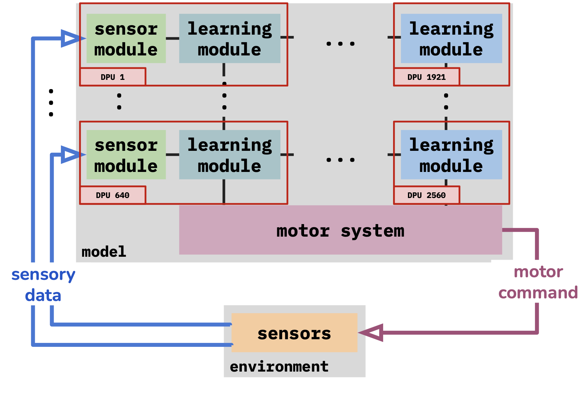

# Montyll-PiM: a Processing-in-Memory implementation of Montyll



Montyll is a novel Thousand Brains System ([code](https://github.com/Xavier0301/cmontyll)) integrating elements of low-level neocortical processing e.g. accurate neuron models [^1][^2] and grid cells to represent location [^3][^4]. Montyll was explicitly designed to be aligned with the long term goals of the Thousand Brains Project ([website](https://thousandbrains.org), [paper](https://arxiv.org/abs/2412.18354)), and it is inspired by N. Leadholm, V. Clay et al.'s implementation named _Monty_ ([code](https://github.com/thousandbrainsproject/tbp.monty), [paper](https://arxiv.org/abs/2507.04494)).

Our goal with Montyll-PiM was to study the consequences of scaling Thousand Brains Systems on Processing-in-Memory hardware. As such, Montyll is not designed to be useful or solve a specific problem. It is rather designed to be a good representation of Thousand Brains Systems computations, especially as they integrate more low-level elements of neocortical processing.

We provide the first implementation of a Thousand Brains System on a Processing-in-Memory architecture. In particular, we use the UPMEM PiM architecture. This repository contains 
- The implementation of Montyll on a PiM core in `dpu/task.c`, which relies on `dpu/tinylib.h`, `dpu/tinymat.h`, `dpu/tinymem.h` and `dpu/utils.h`
- The host program in `host/app.c`, responsible for transfering the inputs and gathering the inputs, as well as dispatching the models to the PiM cores
- The code structure follows the PrIM benchmarks ([code](https://github.com/CMU-SAFARI/prim-benchmarks), [paper](https://ieeexplore.ieee.org/abstract/document/9771457)) from J. Gómez Luna et. al

# Getting started

## Cloning the repo
```
git clone git@github.com:Xavier0301/montyll-pim.git
cd montyll-pim
```
We also clone the `cmontyll` library, which is responsible for creating the models to be dispatched in the DPUs. We move the folder `src` from `cmontyll` to `tbtc-htm` and place it a layer above. 
```
git clone git@github.com:Xavier0301/cmontyll.git
mv ./cmontyll/src ./tbtc-htm
```

## Installing the UPMEM PiM functional simulator
```
docker build -t upmem_sdk_2023 Dockerfile
```

## Running the code
Change `/path/to/folder/` to the path of your `montyll-pim` folder
```
docker run --platform linux/amd64 --rm -it -v /path/to/montyll-pim/:/mnt/host_cwd --workdir /mnt/host_cwd upmem_sdk_2023
make
./bin/host_code
```

[^1]: J. Hawkins and S. Ahmad, “Why neurons have thousands of synapses, a theory of sequence memory in neocortex,” Frontiers in neural circuits, vol. 10, p. 23, 2016

[^2]: S. Ahmad, A. Lavin, S. Purdy, and Z. Agha, “Unsupervised real-time anomaly detection for streaming data,” Neurocomputing, vol. 262, pp. 134–147, 2017

[^3]: M. Lewis, S. Purdy, S. Ahmad, and J. Hawkins, “Locations in the neocortex: A theory of sensorimotor object recognition using cortical grid cells,” Frontiers in neural circuits, vol. 13, p. 22, 2019

[^4]: N. Leadholm, M. Lewis, and S. Ahmad, “Grid cell path integration for movement-based visual object recognition,” arXiv preprint arXiv:2102.09076, 2021
